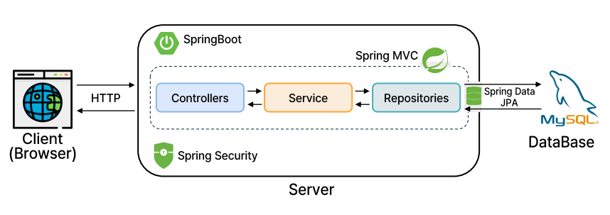

# KODEHUN
#######코리아 좋은 데 헌터
---
## 담당 역할

#### Backend
- 게시글 crud 및 이미지 업로드 통합 구현
- Querydsl을 활용한 동적 검색 구현
- 자동 바인딩 기반 페이징 처리 구현
- 회원 - 게시글 간 즐겨찾기 연관관계 설계 및 토글 기능 구현
- 아이디 중복 확인 및 비밀번호 유효성 검사
#### Frontend
- 담당 게시판 페이지 UI / UX 설계 및 백엔드 API 연계

---

## 기술 스택

- Back-end: Srping Boot, Spring MVC, Spring Data JPA, Spring Security, Querydsl
- Database: MySQL
- Tools & Collaboration: Git, GitHub

---

## 시스템 아키텍처

  

---

## 기획 의도

한국 여행 수요는 꾸준히 증가하고 있지만, 
유명한 관광지 중심으로 정보가 집중되어 있습니다.이 프로젝트는 현지인이 아는 명소를 공유하고 
자유롭게 소통할 수 있도록 기획하였습니다.

---

## 유튜브 링크
https://youtu.be/vfQGMKwUghw?si=c1plljkOAHJiUIup

